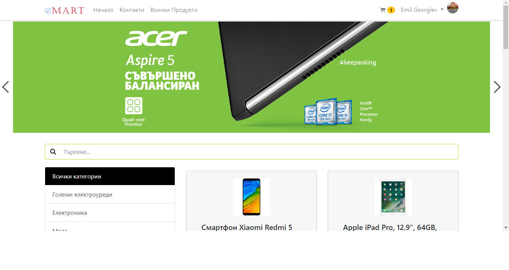

# eMart Shop

This project demonstrates a simple e-commerce application for an imaginary eMart shop. It is built with Angular, Firebase and Bootstrap 4 as the final project.

## live demo

`https://emart-205419.firebaseapp.com/`

## screenshot

Home

## Important 

Before running this application on your machine, create a Firebase project. You need to replace the Firebase settings I've defined in /src/environments with the settings of your own Firebase project.

## Running the Application
Run `npm install` for install all dependencies. 
Run `ng serve` for a dev server. Navigate to `http://localhost:4200/`. 
Run `ng build` for a production. 

